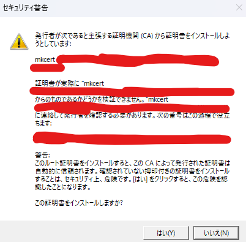

# 空白の5日間
しったこっちゃねー

https://qiita.com/tomomomo1217/items/56d17bf06b56268bd632

ついでにgitにメール認証を追加してみたり

chocoをインストールしたぜ
https://chocolatey.org/install

https://github.com/FiloSottile/mkcert?tab=readme-ov-file

いくぜ

ふえー

mkcert localhostしたら謎ファイルが2つ生まれたんだぜ

多分作り方がめちゃめちゃだった模様

もうやり方ごと買えたろか

https://yuinore.net/2022/03/rails-as-a-static-site-generator/

やはりgithubpages。マルチプレイはやりたかったらやる方針。

https://qiita.com/dz_/items/1245ad590b4b9c6f4f60

https://github.com/jekyll/jekyll?tab=readme-ov-file

やってみるか～