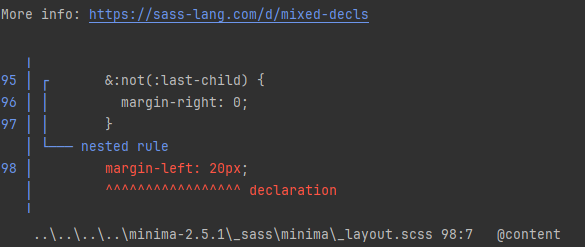

# いくかー
https://music.youtube.com/watch?v=fsDdgKZdTns
ひめミコ、3dにするとおもろいね。デザイン天才だなぁ。
ミクテトの曲の効率的な探し方を見つけてしまった結果多分1000曲ぐらいあるなぁとなってるので割と遠い目。

インすとしつつ消してくぞ～

なんかえらーだー
https://github.com/Maher4Ever/wdm/issues/27
試す
bundle install complete!

一瞬でわろた

https://music.youtube.com/search?q=%E3%81%AF%E3%81%AA%E3%81%82%E3%81%8B%E3%82%8A%E3%80%80%E3%81%B2%E3%82%81%E3%81%BF%E3%81%93
せっかくなのできょうはヒメミコ。

あーホットリロードはナイケドほっと再構築はあるみたいな？

:thinking:
https://www.wizlite.jp/posts/first-post

時代はnextってこと？

まぁそらそう...だてに最強のフレームワークなのっちゃいない...

うるせーーーrubyが触りてーんだよ！！！！(windowsメインpc)

逆張りヤードなので...ユルシテ...

jekyll serve --livereload
ふむ

おーできたできた。

忍耐強く、若いバッタよ、学ぶべきことはまだたくさんある！

なんか絶妙だな、ちょっとむかつくけど好きだよ。

なんかいろいろあってカオスだということは理解した。これはnext使いたくもなるな。別にブログがヤリタいかといわれると諸説あるしなぁ。

ふむ、デフォルトのスタイルとかがあって、それにyamlで値を入れると自動でスタイルをフォーマットして出してくれる。あとはmd書くだけよってスタンスか。

なるほどこれか。

まぁでも別にレイアウトとかいらないっちゃいらないんだよな
https://qiita.com/a999/items/6c29ce072c19448ea579
あいやちがうかもぉ

https://pages.github.com/themes/
ふむ。

https://docs.github.com/ja/pages/setting-up-a-github-pages-site-with-jekyll/adding-a-theme-to-your-github-pages-site-using-jekyll
jekyllってそんなすごいんだ。

breakable作りて～～
なんだそれは

殴ったら壊れるスタイルです。なんですか、それは

純粋に自分用テーマ作りたいけどなぁ。どんなのがいい？

ドットかなぁ。いる？って言われると怪しいけど。
https://00ff.booth.pm/items/5435640
これか？これだなぁ。

まるみーにゃ、かわいすぎ。

いやーーーーー一般的にはマルモニカの方がいい気もする。でもまるみーにゃくそカワイイ

まずはポートフォリオを作らないか？

はい...

## 遅延後
- アップロードしてみる
- docker化
- 壊し方/ファーム考える
- 軽く実装
- 中身考える/レイアウト考える
- まるみーにゃ検討
- (まるミーニャ実装)
- ガッツリ実装

これで

イマイチわかってない部分もあるケド、まぁヨシ

# どっかーか
うーーんbundle installが通らねぇ

うーんとりあえず起動してみて考えよーと思ったけどそんなこともできねぇ
まぁbundleinstallされてないしな？

き、きちゃああああ

こんな起動したとこから汚いというか、たくさんあるのね。

なんか勝手にbundle installしてね？

bundle installできねーーーーー

lock削除したら通った。草。
→もしかしてローカルにlockあればbundleinstallいらないのでは？んーまぁ諸説はある。package.lockとかはどうだっけなぁ。
→lock、してもいいししなくてもいいみたいな感じか。まぁわかるな～

とりあえずgit管理はしない方針で。dockerは諸説。

終了するの草といったところ。

エラー落ち～～～

まぁお前やろなぁ...

うーん。困難で止められるのは大変不快でありますわよ。

むー意外と例外より？
https://www.youtube.com/watch?v=SJcgOWsDwi4&t=0s
とりあえずぎっがー
2:20ぐらいがやっぱいいね～素晴らしい。

お、config.ymlなくしたらいい感じかも？

まぁいったんこれで。