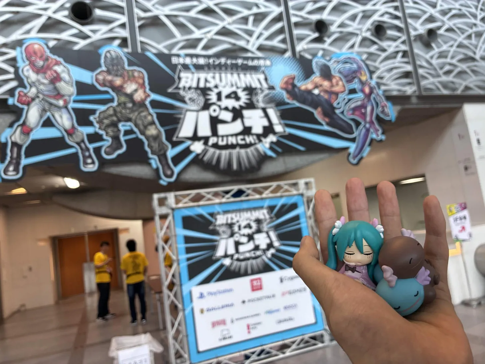
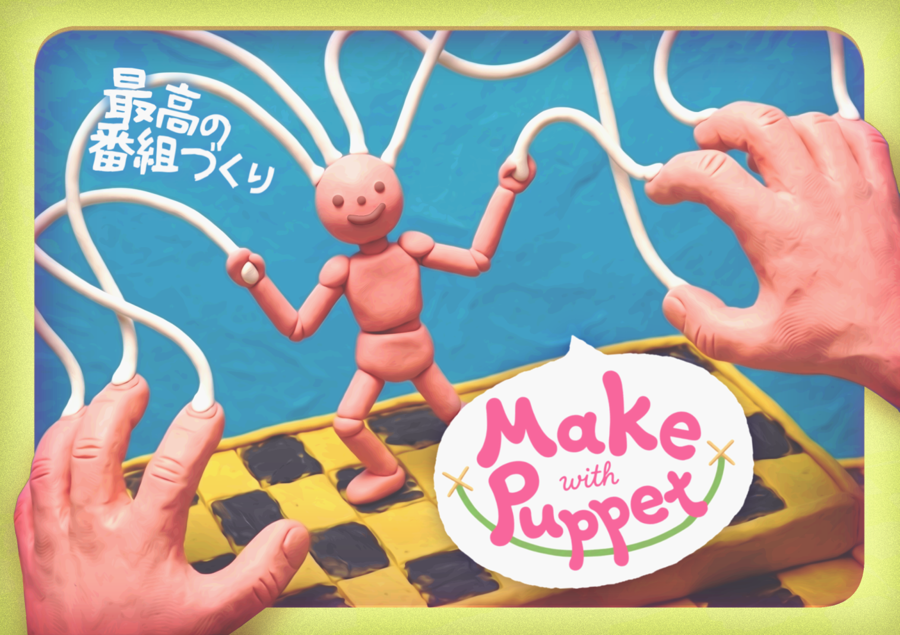
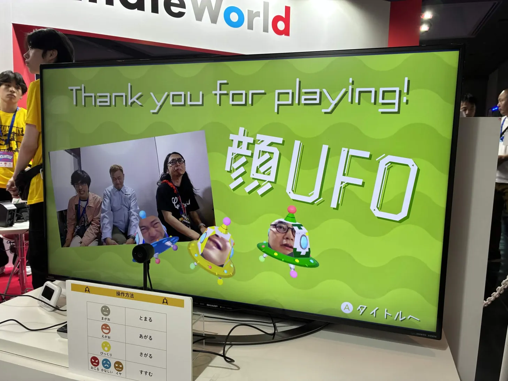
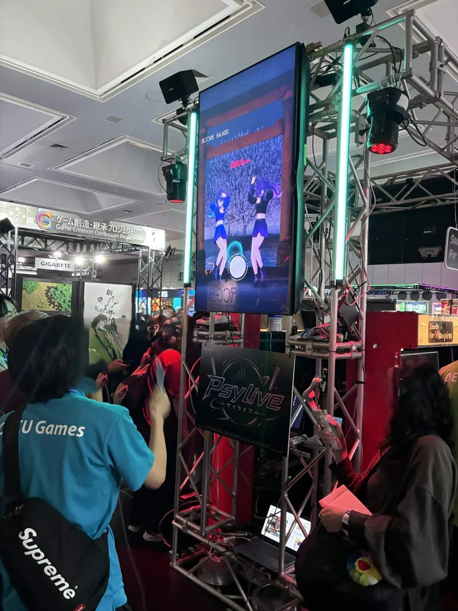

---
title: BitSummitの楽しかったことまとめ
date: 2023-05-26
description: BitSummit GameJam2026とBitSummit Punchの面白かった概念とか
---
ミクさん、ウパーたち、BitSummitだよ

# いったよ
BitSummit GameJam2026に参加し、その展示のためBitSummit Punchに行ってきました。
10～17時の計3日の展示で、その間遊んだり展示したり開発していたりしたので、面白かった概念を中心に軽くかいておきます。

# Make with Puppet
Our game~~~なんかいろいろ受賞したぜ！やったね！いや～～～ちょっと特殊枠すぎますが、いろいろ面白かったねということで
<blockquote class="twitter-tweet">
受賞致しました~~~~🙌  関わって頂いた方々にBIG感謝！！！<a href="https://twitter.com/hashtag/BSGJ2026?src=hash&amp;ref_src=twsrc%5Etfw">#BSGJ2026</a> <a href="https://twitter.com/hashtag/BitSummit?src=hash&amp;ref_src=twsrc%5Etfw">#BitSummit</a> <a href="https://t.co/3rvB60poaH">pic.twitter.com/3rvB60poaH</a>
&mdash; へのへのん (@henohenon_8282) <a href="https://twitter.com/henohenon_8282/status/2058431872045293748?ref_src=twsrc%5Etfw">May 24, 2026</a></blockquote> 

人形をハンドトラッキングで動かしてやろうというゲームです。 4人でコンセプトに揺れ動き、ぐにゃぐにゃしながら、なんとか形にして持っていきました。
が、展示体験があんまりよくなく、、、結局2日目昼まで開発してました。

周りのゲームが最強すぎたのもあり、授賞式では普通にダメだな～ぐー負けか～悔しくなってきたかもしれない。。みたいなことをしていたらXR部門賞で呼ばれ、一瞬頭が追いつきませんでした。メンバーでこれ現実？と喜んでいたら途中から気づいたのですが、株式会社ジュピターの横萩貴史様、フェイチャンネル様と、ほんとにうれしくありがたい限りです。。！

最終的にはオペレーションの練度が上がったのもあり、ある程度安定して楽しんでもらえるようになったのかなと思います。当日の頑張りも報われていたら、、、うれしいな～

ただアイデア賞の側面は強く、コンテンツ・体験としては悩ましいものとなってしまったので、そこはほんとに精進。ギリギリ開発もダメほんと。自分は人形劇とかが結構好きで、その文脈でゲームを作り、遊んで・楽しんでもらうことができたのは結構満足度があってうれしい。。。！

.exeと.app(予定)で配布しているので、もし興味があれば遊んでみてください～

# 顔UFO
王道過ぎてあれですが、さすがに面白すぎたので、、、

顔を4種類に使い分け、止・進・上・下で進んでいくパーティーゲーム。
あまりにも設計が見事、、、進むために全力で変な顔をして、笑いあうゲーム。笑うと上がってしまってミスるとか、うまくいかないときに必死で変な顔をするとか、チェックポイントがほどよくあったり、クリアしてから妨害・アシストのギミックがあったり。ほんとに顔というコンセプトに対してシンプルで面白い操作方法、みんなが楽しめるレベルデザインがしてあって、パーティーゲーとして非常に完成されていると思いました。
アートも見事で、みんなの顔がいい感じにステージに配置してあったり、全体として非常に完成度が高かった。

強いて言うなら誤認識や認識精度はやや課題ありそうだったかも。ただ会場だったことと、こっち側の慣れもありそう。

# GameJam XR部門
身内びいきはまぁあると思いますが、それでもやっぱりすごいと思ったので紹介をば。

<blockquote class="twitter-tweet">
🔥ヘドバンで沸かせ、ス鳥ートパフォーマー！🔥  VRヘドバンリズムランアクション 『TORIMA HEADBANG（トリマヘドバン）』が<a href="https://twitter.com/hashtag/BitSummit?src=hash&amp;ref_src=twsrc%5Etfw">#BitSummit</a> 【1F-A18】に登場だ！🦜🫨  リズムにノってヘドバンすれば イカした冠羽が風を起こして爆走するぜ！💨<a href="https://t.co/7WrGc0d8Hj">https://t.co/7WrGc0d8Hj</a><a href="https://twitter.com/hashtag/TorimaHeadbang?src=hash&amp;ref_src=twsrc%5Etfw">#TorimaHeadbang</a> <a href="https://twitter.com/hashtag/%E3%83%88%E3%83%AA%E3%83%9E%E3%83%98%E3%83%89%E3%83%90%E3%83%B3?src=hash&amp;ref_src=twsrc%5Etfw">#トリマヘドバン</a> <a href="https://t.co/itevvzxVkn">pic.twitter.com/itevvzxVkn</a>
&mdash; TORIMA HEADBANG / トリマヘドバン (@TorimaHeadbang) <a href="https://twitter.com/TorimaHeadbang/status/2056147758281863557?ref_src=twsrc%5Etfw">May 17, 2026</a></blockquote> 
ヘドバンするゲーム。ゲームジャムのアワードで、一番でかいやつはこいつがかっさらっていきました。見た目のわかりやすさ、派手さ、めちゃくちゃなコンセプトを丁寧にまとめあげられた作品。それに加えてこのチーム、アートとX運用と展示がめちゃめちゃクオリティ高いんだよな～～～～すげ～～。ほんとに売る気で本気で作ってやがる。どこをとってもそつがなく、パワフルな作品だなと感じました。
展示に力を入れるタイプの、やりたいとは思いつつできていないので、どこかでいつかは。。。

<blockquote class="twitter-tweet">
【新作】 VR×フィットネス×ローグライクアクション！  その名も、「FitSurvivorVR」！  スクワット&amp;パンチで敵と筋肉を痛めつけよう！  5/22〜5/24 BitSummitで展示します！  ブース番号XRGJ-04にてお待ちしております！<a href="https://twitter.com/hashtag/BitSummit?src=hash&amp;ref_src=twsrc%5Etfw">#BitSummit</a> <a href="https://twitter.com/hashtag/BSGJ2026?src=hash&amp;ref_src=twsrc%5Etfw">#BSGJ2026</a><a href="https://twitter.com/hashtag/Unity?src=hash&amp;ref_src=twsrc%5Etfw">#Unity</a> <a href="https://twitter.com/hashtag/gamedev?src=hash&amp;ref_src=twsrc%5Etfw">#gamedev</a> <a href="https://twitter.com/hashtag/indiegame?src=hash&amp;ref_src=twsrc%5Etfw">#indiegame</a> <a href="https://twitter.com/hashtag/VR?src=hash&amp;ref_src=twsrc%5Etfw">#VR</a> <a href="https://t.co/BKSxgEpwuU">pic.twitter.com/BKSxgEpwuU</a>
&mdash; もとねふ/(たかみ) (@takami_vr) <a href="https://twitter.com/takami_vr/status/2057430242701234243?ref_src=twsrc%5Etfw">May 21, 2026</a></blockquote> 
運動でローグライクするゲーム。ゲームの設計が、うますぎる。丁寧に、アートが作ってある。あまりにもよかったな～。マジで体験する人が楽しんで運動していた。。そうそうできねぇよそんなの。
あと操作体験かなりいいんですよね～～～いくつか操作で引っかかるところはありはするんだけど、見づらいとかはマジでなくって。
XR部門展示で一番人を深く没入させてたのはこのゲームだった気がします。

<blockquote class="twitter-tweet">
🎮明日明後日開催！ 岐阜大学デジ創のVRゲーム体験会👻🔥  協力VRホラーシューティング 『デュアルサイトディフェンス』が遊べる！  📅 4/25(土)・26(日) 📍 全共22教室  友達と一緒にぜひ！🙌<a href="https://twitter.com/hashtag/%E5%B2%90%E5%A4%A7?src=hash&amp;ref_src=twsrc%5Etfw">#岐大</a> <a href="https://twitter.com/hashtag/VR%E3%82%B2%E3%83%BC%E3%83%A0?src=hash&amp;ref_src=twsrc%5Etfw">#VRゲーム</a> <a href="https://t.co/2HVgn1yaxZ">pic.twitter.com/2HVgn1yaxZ</a>
&mdash; 岐阜大学デジタル創作同好会 (@ProgCirGifuUni) <a href="https://twitter.com/ProgCirGifuUni/status/2047652640272822642?ref_src=twsrc%5Etfw">April 24, 2026</a></blockquote> 
マルチVRシューティング？
二人プレイ！すごい！なんかすごい質量を感じる作品でした。プログラムもモデルも展示も。いや～～人のモデル作ってVRとマルチプレイと通話とかまでだからなぁ。ちゃんとバグなくまとめ上げてるし。末恐ろしい。マルチプレイはやっぱ楽しいんだよな～FPS的なコールが飛び交っていた。

# ANRI
手を突っ込んで遊ぶほうを遊びました！
<blockquote class="twitter-tweet">
<a href="https://twitter.com/hashtag/%E3%82%B9%E3%83%BC%E3%83%91%E3%83%BC%E3%82%B2%E5%88%B6%E3%83%87%E3%83%BC?src=hash&amp;ref_src=twsrc%5Etfw">#スーパーゲ制デー</a> という事で改めて自己紹介🙋‍♂️  ビートに合うともっと強くなる2Dアクション 『紙装甲主人公と不死身のカエル』  そして 箱型筐体に手を突っ込んで遊ぶSTG 『ANRI』を制作しています  よろしくお願いします <a href="https://t.co/lWktfHG5s2">pic.twitter.com/lWktfHG5s2</a>
&mdash; シロ@ゲームdeおはなし (@petit_zome) <a href="https://twitter.com/petit_zome/status/2052766652593483794?ref_src=twsrc%5Etfw">May 8, 2026</a></blockquote> 
あまりにもみたことがない表現形式でめっちゃいいな～～～～展示向けとかじゃなくて、ちゃんとしたSTGっぽく成立してそうだったのがなかなかとんでもない。出来もま～じでクオリティ高かった。。。しっと。
展示体験専門のゲーム、なかなか乙だなと思いました。スペックなどをある程度無視して作れるし、文脈としてもなかなかいい。

# PsyLive-サイライブ-
個人的にやれてないけどメッチャよかったゲーム！

ぱっと見で何なのかわかるし、展示形式がよすぎる～～～あまりにもこういうのでいいんだよが美しくまとまっててよいなとなりました。

大阪電気通信大学チームの作品っぽいのですが、まっとうな作品リンクみたいなのが、ない。。。
https://www.osakac.ac.jp/news/2026/3874

# おわりに
私が遊べたものだけでも一部も一部で、世界には興味深いゲームがいっぱいあって、とてもいいねになりました。ほかにもほんといろいろ面白かったです、ビール注ぐやつとか、ゴルフするやつとか。

インディーゲームというか、こういうやっちゃえ系の創作は狂気が感じられてよいですね。 この様子のおかしな熱量はゲーム制作の大きな魅力な気がします(主語巨大。
個人的にもだいぶ熱に浮かされたり、考えが変わったりと、得るものの多い会でした。ものをつくるよ