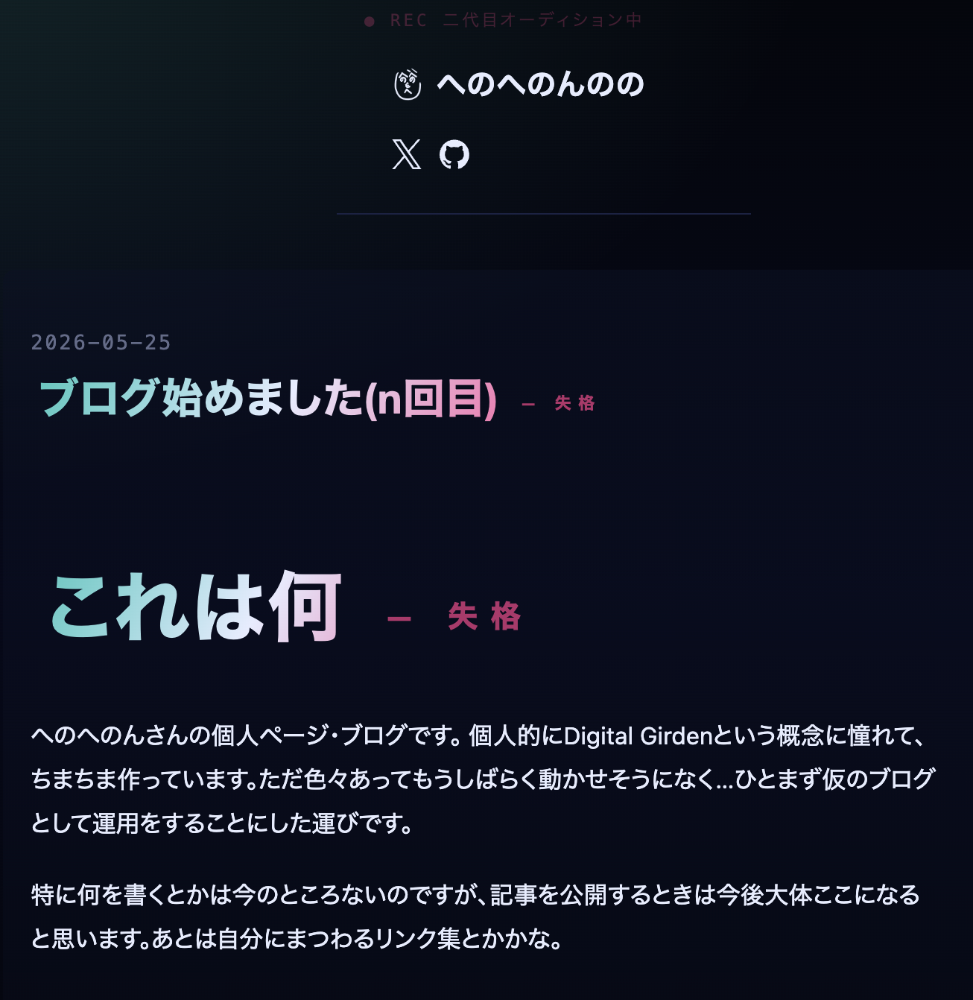

# これは何
へのへのんさんの個人ページ・ブログです。
個人的にDigital Gardenという概念に憧れて、ちまちま作っています。ただ色々あってもうしばらく動かせそうになく...ひとまず仮のブログとして運用をすることにした運びです。

特に何を書くとかは今のところないのですが、記事を公開するときは今後大体ここになると思います。あとは自分にまつわるリンク集とかかな。
# 毎日見た目の変わるサイト
せっかく作るなら多少遊びたい。ということで"毎日テーマソングに沿って見た目が変わるサイト"という形で今回はまとめてみました。

どちらかというとライフログなどに結び付けたかったのですが、ひとまずは手短に。単体としてみたときのデザインはそこまでですが、構造やコンセプトは気に入っています。

ちなみに今日は歌姫失格で、こんな見た目です。チラ見せ

## スタックなど
Astro/Claude Code Cli/VocaDB API
とかとか。技術的にはシンプルですね。まだ手動更新しかないので、そのうちschedule用の何かが生えると思います。

ピックアップはVocaDB直近30日の人気かつ歌詞のある曲としています。VocaDBコミュニティに依存することにはなりますが、比較的ほどよく最新のいい曲が反映されるのではないでしょうか。

記録はがっつり別スクリプトでjsonなのですが、ここだけrust+dbとかにしてもいいかもしれませんね。